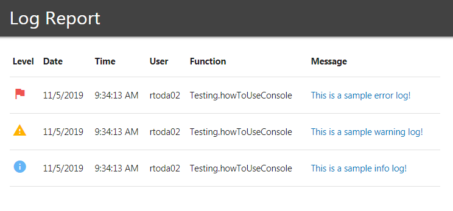

# VBA Boilerplate

A template for easily creating complex projects with VBA.

This includes a bunch of helper libraries, JSON tools, Code Analytics, LocalStorage, Unit Testing, version control and local network distribution.

This was created to be a full application companies can use to share with users.

---

## Other Helpful Resources

- [www.roberttodar.com](https://www.roberttodar.com/) - About me and my background and some of my other projects.
- [VBA Style Guide](https://github.com/todar/VBA-Style-Guide) - A guide for writing clean VBA code. Notes on how to take notes =)
- [VBA Arrays](https://github.com/todar/VBA-Arrays) - Array function library, functions that mimic JavaScript Arrays.
- [VBA Strings](https://github.com/todar/VBA-Strings) - String function library. `ToString`, `Inject`, `StringSimilarity`, and more.
- [VBA Userform Event Listener](https://github.com/todar/VBA-Userform-EventListener) - Listen to events such as `mouseover`, `mouseout`, `focus`, `blur`, and more.

---

## Table of Contents

1. [Usage](#Usage)
1. [JSON](#JSON)
1. [Analytics](#Analytics)
1. [Console](#Console)
1. [LocalStorage](#LocalStorage)
1. [Testing](#Testing)
1. [Distribution](#Distribution)

---

## Usage

This project is really meant to be used as a complete package. You can [download the latest release](https://github.com/todar/VBA-Boilerplate/archive/v0.1.0-beta.zip) or run `git clone https://github.com/todar/VBA-Boilerplate.git`.

Alternativly, you can use the source code and pick and choose the tools you need. Just note, many of these tools rely on one another.

There are notes of the references of tools used so you can try to package together what you need but these notes **are not perfect.**

[↑ back to top](#Table-of-Contents)

---

## JSON

A major tool that is used throughout this project is the JSON class Module. This is an adaptation from [VBA-JSON](https://github.com/VBA-tools/VBA-JSON).

This difference with this version is that it is a class module that has a default instance so it can be used without declaring it. This way it mimics the way it would be used in JavaScript.

Also changed `ParseJson` to simply `Parse` and `ConvertJSON` to `Stringify`.

### Example

```vb
'/**
' * Sample of how to use JSON
' * @ref {Class Module} JSON
' * @ref {Library} Microsoft Scripting Runtime
' */
Private Sub howToUseJSON()
    ' Here is some sample data. The outer object must be an Array, Dictionary, or
    ' a Collection. This is to make it valid JSON.
    ' A note is that Arrays will be parsed as collections for performance reasons.
    Dim config As New Scripting.Dictionary
    config.Add "name", "JSONSample"
    config.Add "users", Array("Robert", "Fred", "Mark")

    ' Stringify will turn a Dictionary or Array into a string of JSON.
    ' This can be stored in a text file a parsed back into an object
    ' using JSON.Parse. Example of that below.
    ' This example: ~> {"name":"JSONSample","users":["Robert","Fred","Mark"]}
    Dim JSONString As String
    JSONString = JSON.Stringify(config)
    Debug.Print JSONString

    ' This example uses the JSON string from above and converts it into
    ' VBA Dictionary. Note that the Array from above is converted into
    ' a Collection. This is due to performance in iterating over the list
    ' while parsing.
    Dim clone As Scripting.Dictionary
    Set clone = JSON.Parse(JSONString)
End Sub
```

[↑ back to top](#Table-of-Contents)

---

## Analytics

This is a helpful class that will track things such as code usage per code and per user, time savings, date, time, runtime, or custom events.

Each event is a JSON object and is appended to a JSON file. For performance reasons, this doesn't parse the JSON each time, instead it is simply appended to the end of the file with a comma at the end of it. For this reason, there is not an opening or closing array brackets either, meaning to use the JSON file you must add these brackets and remove the last comma on the last record.

### Example

```vb
'/**
' * Sample of how to track and use Analytics class.
' * An example log looks something like: {"event":"onUse", ...},
' * @ref {Class Module} AnalyticsTracker
' * @ref {Class Module} JSON
' * @ref {Module} FileSystemUtilities
' * @ref {Library} Microsoft Scripting Runtime
' */
Private Sub howToTrackAnalytics()
    ' This tracks to a JSON file and the immediate window.
    ' To be effecent this appends to the text file.
    ' Because of this the JSON file is missing the outer array
    ' brackets []. Also includes a comma after each object {},
    ' So to use this as JSON you must edit those two things.
    Dim analytics As New AnalyticsTracker

    ' You can track standard stats for code use!
    ' This collects codeName, username, date, time, timesaved, runtime
    analytics.TrackStats "test", 5

    ' Can also add custom stats to the main thread.
    analytics.AddStat "customStat", "I'm custom!"

    ' Also have the ability to log your own custom events. This by default
    ' still adds things like date, time, username.
    analytics.LogEvent "onCustom", "name", "Robert", "age", 31

    ' Optional! You can either call this function, or let the
    ' terminate event in the class to run it. Really the only
    ' function that needs to be called in order to collect stats
    ' is `TrackStats` or `AddStat`. Put that at the top of a function
    ' and it will log all the basic stats.
    analytics.FinalizeStats
End Sub
```

#### Analytics JSON file Example

_Note that this is after it has added the array brackets `[]` and removed the last comma on the second record._

```json
[
  {
    "event": "onCustom",
    "id": "3C1C232D5D1E457E99488784F6CAD9C1",
    "username": "rtoda02",
    "date": "11/5/2019",
    "time": "9:40:52 AM",
    "name": "Robert",
    "age": 31
  },
  {
    "event": "onUse",
    "id": "27985BF694144102BA13914D968C735D",
    "codeName": "test",
    "username": "rtoda02",
    "date": "11/5/2019",
    "time": "9:40:52 AM",
    "minutesSaved": 5,
    "customStat": "I'm custom!",
    "runtimeSeconds": 0.012
  }
]
```

[↑ back to top](#Table-of-Contents)

---

## Console

A simple and easy way to log info, warnings, or especially errors from all your users. This again is created to mimic JavaScripts Console in a limited way. This stores each log to both the users system and the shared file.

Just like the JSON Class Module, this one also has a default instance and doesn't need to be declared in order to use.

For neatness in looking at the report, uses a template HTML file located at `./templates/console.html`. So this file is required in order to work.

### Example

```vb
'/**
' * Sample of how to use Console
' * @ref {Modlue} FileSystemUtilities
' * @ref {Function} FileSystemUtilities.BuildOutFilePath
' * @ref {Function} FileSystemUtilities.ReadTextFile
' * @ref {File} `./templates/console.html`
' */
Private Sub howToUseConsole()
    ' Each method takes in a source so the log knows where the log occured
    ' and a message, and this can be whatever makes the most sense.
    ' The various methods have a different style logo for each one and
    ' would be used to filter on each one.
    ' This also logs to the immediate window as well.
    Console.Log "Testing.howToUseConsole", "This is a sample info log!"
    Console.Warn "Testing.howToUseConsole", "This is a sample warning log!"
    Console.Error "Testing.howToUseConsole", "This is a sample error log!"
End Sub
```

#### Immediate window Results

```
[+] [9:34:13 AM] [Testing.howToUseConsole] This is a sample info log!
[!] [9:34:13 AM] [Testing.howToUseConsole] This is a sample warning log!
[X] [9:34:13 AM] [Testing.howToUseConsole] This is a sample error log!
```

#### HTML Report Example



[↑ back to top](#Table-of-Contents)

---

## LocalStorage

LocalStorage is a nice way of storing things such as settings and remember things the user might need in later sessions. This is all stored as JSON in a JSON file stored in the users system.

### Example

```vb
'/**
' * Sample of how to use LocalStorage
' * @ref {Library} Microsoft Scripting Runtime
' * @ref {Class Module} Console - Used to log to immediate window and log files.
' * @ref {Class Module} JSON - Used to store key value pairs.
' * @ref {Modlue} FileSystemUtilities
' * @ref {Function} FileSystemUtilities.BuildOutFilePath
' * @ref {Function} FileSystemUtilities.ReadTextFile
' */
Private Sub howToUseLocalStorage()
    ' Setting an item is easy, it stores info based on key value pairs.
    ' This will either override what's in there or create a new pair if
    ' it doesn't already exist.
    LocalStorage.SetItem "name", "Robert"

    ' Getting an item you simply call it by the key you stored it as.
    ' By default you have to pass in a fallback value. This value is used
    ' only if there is some error in retriving the value or if it doesn't
    ' exist. This helps prevent any errors.
    Dim name As String
    name = LocalStorage.GetItem("name", "Robert")

    ' Easily show the storage in the immediate window.
    LocalStorage.DisplayToImmediateWindow

    ' Easily remove a sinlge item by it's key
    LocalStorage.RemoveItem "name"

    ' Or you can remove all items and reset the storage back to an empty object {}
    LocalStorage.Clear
End Sub
```

[↑ back to top](#Table-of-Contents)

---

## Testing

These are several Class Modules and a Factory function to easily create tests. This is still in early development but can be used for simple use cases.

The function `Test` is a factory method to easily run tests without having to create a `TestSuite` class. See the example below of how to use this, the easiest way of learning it is by playing around with this example.

The naming convention for test functions is that they should all start with `Test` to easily find them and run them for the immediate window.

### Example

```vb
'**/
' * Sample of how to use the unit testing tools.
' *
' * @ref {Class Module} TestSuite - Collection of tests.
' * @ref {Class Module} TestCase - A group of related tests.
' * @ref {Class Module} TestMatcher - The test functions.
' * @ref {Class Module} PerformanceTimer - To track runtime.
' */
Public Function TestSampleTests() As TestSuite
    With test("Sample Math tests")
        With .test("two plus two")
            .Expect(2 + 2).ToEqual 4
            .Expect(2 + 2).ToBeLessThan 5
        End With

        With .test("six times one")
            .Expect(6 * 1).ToEqual 6
            .Expect(6 * 1).ToBeGreaterThanOrEqual 6
        End With

        With .test("five minus two")
            .Expect(5 - 2).ToEqual 3
            .Expect(5 - 2).ToBeGreaterThan 2
        End With

        With .test("Adding 1 + 1 equals 2")
            .Expect(1 + 1).ToEqual 2
        End With
    End With
End Function
```

#### Immediate Window

```
--------------------------------------
# Sample Math tests
--------------------------------------
+ two plus two (2.644ms)
+ six times one (0.024ms)
+ five minus two (0.089ms)
+ Adding 1 + 1 equals 2 (0.076ms)

Test Cases: 4 passed, 4 total
Tests:      7 passed, 7 total
Time:       2.833ms
Status:     PASS
```

[↑ back to top](#Table-of-Contents)

---

## Distribution

Docs on the way!

[↑ back to top](#Table-of-Contents)
